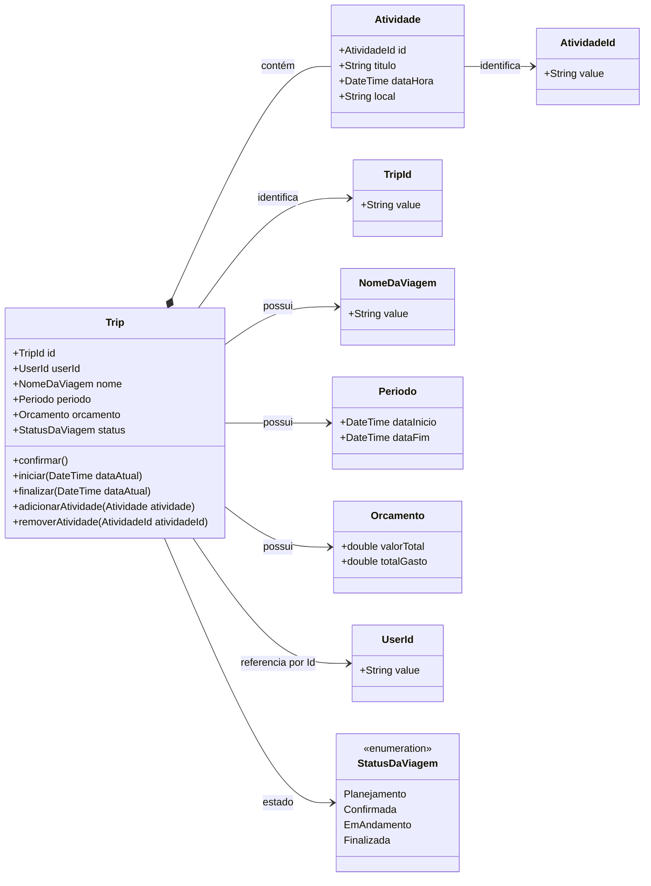

# 📚 Trabalho — Design Tático no DDD (Template para qualquer domínio)

> **Como usar:** copie este arquivo e substitua os **[colchetes]** com informações do **seu domínio** (e-commerce, marketplace, logística, educação, fintech, games, etc.).
> O objetivo é praticar Entidades, Value Objects, Agregados/AR, Repositórios e Eventos de Domínio — com foco em **invariantes** e **domínio rico**.

---

## 🚀 Quick start (5 passos)

1. Escolha um **domínio** que você conheça (ex.: **Planejamento Inteligente de Viagens**).
2. Liste 3–7 **invariantes** que devem estar corretas no **commit**.
3. Escolha 1–2 **Agregados principais** (comece por **Viagem**).
4. Desenhe a **máquina de estados** e os **eventos** que surgem das transições.
5. Defina o **Repositório**.

---

## 🧳 1) Sobre o Domínio Escolhido

**Nome do domínio:** Planejamento Inteligente de Viagens.  

**Objetivo do sistema:** Facilitar o planejamento de viagens por meio de recomendações personalizadas, organização de roteiros e gestão inteligente de orçamento.  

**Principais atores:** Viajante.  

**Contextos (opcional):** Perfil de Viajante, Planejamento de Viagem, Curadoria de Locais, Gestão de Dados de Locais, Orçamento, Autenticação e Assinatura.

---

## 🧩 2) Entidades vs Value Objects

Preencha a tabela justificando cada tipo (identidade vs. imutabilidade).

| Elemento            | Tipo (Entidade/VO) | Por quê? (identidade/imutável) |
|---------------------|--------------------|--------------------------------|
| **Viajante**        | Entidade           | Possui identidade própria (UserId) e ciclo de vida. Mesmo que email, nome ou senha mudem, continua sendo o mesmo usuário no sistema. |
| **Email**           | Value Object       | Não possui identidade própria. Dois emails iguais representam o mesmo valor. Deve ser imutável e validado na criação. |
| **Senha**           | Value Object       | Não possui identidade própria, é imutável e possui regras de segurança. Representa o hash da senha e igualdade baseada no valor. |
| **NomeDoViajante**  | Value Object       | Representa apenas um valor sem identidade própria. Deve conter nome e sobrenome, sendo imutável e validado. |
| **Viagem**          | Entidade           | Possui identidade única (TripId) e estado próprio. Seu ciclo de vida é independente de seus atributos. |
| **NomeDaViagem**    | Value Object       | Representa apenas um valor sem identidade própria. Igualdade baseada no valor e deve ser imutável. |
| **Orçamento**       | Value Object       | Representa valor monetário com regras (não pode ser negativo). Igualdade por valor e moeda. |
| **Período**         | Value Object       | Intervalo de datas sem identidade própria. Deve validar que data inicial é menor que a final. |
| **Atividade**       | Entidade           | Possui identidade dentro da Viagem e pode ser alterada/removida individualmente. Seu ciclo de vida depende da Viagem. |

> Dica: Promova tipos semânticos: `Email`, `Password`, `Money`, `IntervaloDeTempo`, `Endereco`, `Percentual`, `Quantidade`, etc. **VOs devem ser imutáveis** e com **igualdade por valor**.

---

## 🏗️ 3) Agregados e Aggregate Root (AR)

**Agregado Principal:** **Viagem**

**Conteúdo interno do agregado (apenas o necessário para consistência local):**

- **TripId (VO)**
- **NomeDaViagem (VO)**
- **Periodo (VO)**
- **Orcamento (VO)**
- **StatusDaViagem (Enum)**
- **Atividade (Entidade interna do agregado)**

**Referências a outros agregados (por ID):**

- **UserId** (ViajanteId — não conter dentro do agregado)

**Boundary — Por que cada item está dentro/fora?**

- **Dentro porque** a Viagem precisa garantir consistência transacional sobre suas invariantes, como:
  - Não permitir atividades fora do período.
  - Não permitir orçamento negativo.
  - Não permitir iniciar viagem sem atividades.
  - Controlar corretamente o status da viagem.
  - Garantir integridade do roteiro.
  - Controlar regras críticas do negócio que influenciam operações permitidas.

- **Atividade está dentro porque** seu ciclo de vida depende totalmente da Viagem e suas regras precisam ser protegidas pelo Aggregate Root.

- **UserId está fora porque** Usuário pertence a outro agregado (Contexto de Autenticação). A Viagem apenas referencia o dono por ID, evitando acoplamento forte entre agregados.

---

## 🔒 4) Invariantes e Estados do Agregado

### Invariantes (devem ser verdadeiras ao final de cada transação)

#### 📌 Invariantes do Agregado Viagem

- O Período da Viagem deve ser válido (dataInicio < dataFim).
- Não permitir atividade fora do período da viagem.
- Não permitir confirmar uma viagem sem ao menos uma atividade cadastrada.
- Não permitir iniciar uma viagem sem ao menos uma atividade cadastrada.
- Não permitir finalizar viagem sem ao menos uma atividade cadastrada.
- Não permitir adicionar ou remover atividades se a viagem estiver Finalizada.
- NomeDaViagem não pode ser vazio.
- O status da viagem deve sempre estar em um estado válido do enum StatusDaViagem.

#### 📌 Invariantes do Orçamento (Entidade interna da Viagem)

- O valor total definido para o orçamento não pode ser negativo.
- O total gasto deve ser sempre igual à soma dos gastos registrados.
- Cada gasto deve possuir valor positivo.
- A alteração de gastos é permitida em qualquer status da viagem.

#### 📌 Invariantes do Agregado Viajante (Usuário)

- Email deve possuir formato válido.
- NomeDoViajante deve conter pelo menos nome e sobrenome.
- Senha deve possuir no mínimo 8 caracteres e atender às regras de segurança definidas.
- Senha deve ser armazenada apenas como hash (nunca em texto puro).

---

## 🔄 Estados e Transições da AR Viagem

- Planejamento -> Confirmada -> EmAndamento -> Finalizada

### Regras:

- Planejamento → Confirmada  
  - Permitida se o período for válido.  
  - Permitida se existir pelo menos uma atividade cadastrada.

- Confirmada → EmAndamento  
  - Permitida se a data atual for igual ou posterior à data de início.  
  - Permitida apenas se existir pelo menos uma atividade cadastrada.

- EmAndamento → Finalizada  
  - Permitida se a data atual for posterior à data final.

- Finalizada → qualquer outro estado  
  - Bloqueada (estado terminal).

- Adicionar/Remover Atividade  
  - Permitido se o status for Planejamento, Confirmada ou EmAndamento.  
  - Bloqueado apenas se o status for Finalizada.

- Registrar/Remover Gasto  
  - Permitido em qualquer status da viagem.  
  - O total gasto deve ser recalculado após cada operação.

---

## 🗃️ 5) Repositório do Agregado (interface)
> Repositório trabalha **apenas com a AR**, sem expor entidades internas do agregado. Consultas analíticas ficam fora (read models).

```dart
abstract interface class TripRepository {
  Future<Trip?> getById(TripId id);

  Future<void> add(Trip trip);

  Future<void> save(Trip trip);

  Future<void> remove(TripId id);
}
```


---

## 📣 6) Eventos de Domínio

Os eventos representam acontecimentos relevantes dentro do domínio de **Planejamento Inteligente de Viagens (TravelWall)**.  
Eles são publicados preferencialmente **após o commit (pós-commit)** para garantir consistência do agregado e permitir comunicação desacoplada entre bounded contexts.

| Evento | Quando ocorre | Payload mínimo | Interno/Integração | Observações |
|---|---|---|---|---|
| **ViagemCriada** | Quando uma nova viagem é criada pelo viajante | TripId, UserId | Interno | Inicializa o planejamento dentro do contexto de Planejamento de Viagem |
| **ViagemConfirmada** | Quando a viagem muda de *Planejamento* para *Confirmada* | TripId, DataInicio | Integração | Permite geração de recomendações e preparação do roteiro |
| **AtividadeAdicionada** | Quando uma atividade é adicionada à viagem | TripId, AtividadeId | Interno | Dispara validações e otimização do roteiro |
| **ViagemFinalizada** | Quando a viagem passa para o estado *Finalizada* | TripId, DataFim | Integração | Pode gerar estatísticas, feedbacks e conquistas do viajante |

### Observações

- Eventos representam **fatos do domínio**, não comandos técnicos.
- O payload contém apenas dados essenciais (IDs e informações mínimas).
- Eventos **internos** atuam dentro do mesmo bounded context.
- Eventos de **integração** permitem comunicação com outros contextos do sistema.
- Todos os eventos são publicados após persistência da transação (**pós-commit**).

---

## 🗺️ 8) Diagrama (Mermaid)



---

## ✅ Checklist de Aceitação
- [ ] **VOs imutáveis** e com **igualdade por valor** (nada de “string de CPF/Email”).
- [ ] **Boundary do agregado** pequeno e com **invariantes claras**.
- [ ] **Domínio rico**: operações do negócio como métodos (evitar `set` aberto).


## 📤 Entrega

- **Inclua**: link/imagem do **diagrama** + todas as seções acima preenchidas.
---

