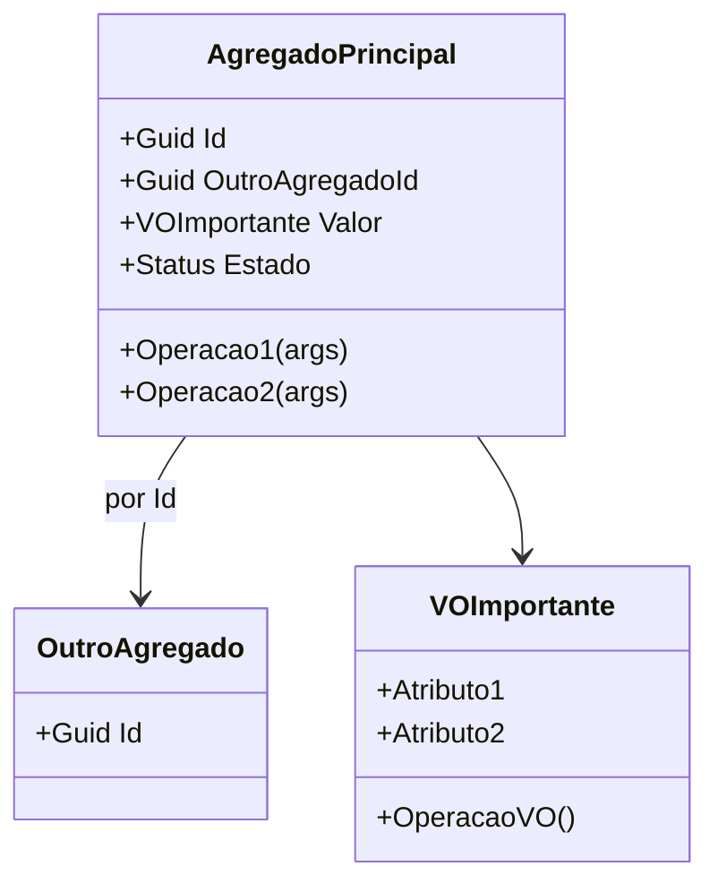

# 📚 Trabalho — Design Tático no DDD (Template para qualquer domínio)

> **Como usar:** copie este arquivo e substitua os **[colchetes]** com informações do **seu domínio** (e-commerce, marketplace, logística, educação, fintech, games, etc.).
> O objetivo é praticar Entidades, Value Objects, Agregados/AR, Repositórios e Eventos de Domínio — com foco em **invariantes** e **domínio rico**.

---

## 🚀 Quick start (5 passos)

1. Escolha um **domínio** que você conheça (ex.: **Planejamento Inteligente de Viagens**).
2. Liste 3–7 **invariantes** que devem estar corretas no **commit**.
3. Escolha 1–2 **Agregados principais** (comece por **Viagem**).
4. Desenhe a **máquina de estados** e os **eventos** que surgem das transições.
5. Defina o **Repositório**.

---

## 🧳 1) Sobre o Domínio Escolhido

**Nome do domínio:** Planejamento Inteligente de Viagens.  

**Objetivo do sistema:** Facilitar o planejamento de viagens por meio de recomendações personalizadas, organização de roteiros e gestão inteligente de orçamento.  

**Principais atores:** Viajante.  

**Contextos (opcional):** Perfil de Viajante, Planejamento de Viagem, Curadoria de Locais, Gestão de Dados de Locais, Orçamento, Autenticação e Assinatura.

---

## 🧩 2) Entidades vs Value Objects

Preencha a tabela justificando cada tipo (identidade vs. imutabilidade).

| Elemento            | Tipo (Entidade/VO) | Por quê? (identidade/imutável) |
|---------------------|--------------------|--------------------------------|
| **Viajante**        | Entidade           | Possui identidade própria (UserId) e ciclo de vida. Mesmo que email, nome ou senha mudem, continua sendo o mesmo usuário no sistema. |
| **Email**           | Value Object       | Não possui identidade própria. Dois emails iguais representam o mesmo valor. Deve ser imutável e validado na criação. |
| **Senha**           | Value Object       | Não possui identidade própria, é imutável e possui regras de segurança. Representa o hash da senha e igualdade baseada no valor. |
| **NomeDoViajante**  | Value Object       | Representa apenas um valor sem identidade própria. Deve conter nome e sobrenome, sendo imutável e validado. |
| **Viagem**          | Entidade           | Possui identidade única (TripId) e estado próprio. Seu ciclo de vida é independente de seus atributos. |
| **NomeDaViagem**    | Value Object       | Representa apenas um valor sem identidade própria. Igualdade baseada no valor e deve ser imutável. |
| **Orçamento**       | Value Object       | Representa valor monetário com regras (não pode ser negativo). Igualdade por valor e moeda. |
| **Período**         | Value Object       | Intervalo de datas sem identidade própria. Deve validar que data inicial é menor que a final. |
| **Atividade**       | Entidade           | Possui identidade dentro da Viagem e pode ser alterada/removida individualmente. Seu ciclo de vida depende da Viagem. |

> Dica: Promova tipos semânticos: `Email`, `Password`, `Money`, `IntervaloDeTempo`, `Endereco`, `Percentual`, `Quantidade`, etc. **VOs devem ser imutáveis** e com **igualdade por valor**.

---

## 🏗️ 3) Agregados e Aggregate Root (AR)

**Agregado Principal:** **Viagem**

**Conteúdo interno do agregado (apenas o necessário para consistência local):**

- **TripId (VO)**
- **NomeDaViagem (VO)**
- **Periodo (VO)**
- **Orcamento (VO)**
- **StatusDaViagem (Enum)**
- **Atividade (Entidade interna do agregado)**

**Referências a outros agregados (por ID):**

- **UserId** (ViajanteId — não conter dentro do agregado)

**Boundary — Por que cada item está dentro/fora?**

- **Dentro porque** a Viagem precisa garantir consistência transacional sobre suas invariantes, como:
  - Não permitir atividades fora do período.
  - Não permitir orçamento negativo.
  - Não permitir iniciar viagem sem atividades.
  - Controlar corretamente o status da viagem.
  - Garantir integridade do roteiro.
  - Controlar regras críticas do negócio que influenciam operações permitidas.

- **Atividade está dentro porque** seu ciclo de vida depende totalmente da Viagem e suas regras precisam ser protegidas pelo Aggregate Root.

- **UserId está fora porque** Usuário pertence a outro agregado (Contexto de Autenticação). A Viagem apenas referencia o dono por ID, evitando acoplamento forte entre agregados.

---

## 🧭 4) Invariantes e Máquina de Estados
Liste invariantes (devem ser verdadeiras ao final de cada transação).

**Invariantes (exemplos):**
- **[Não aceitar pagamento acima do limite de crédito]**
- **[Não permitir slot de horário sobreposto para o mesmo recurso]**
- **[Não permitir alteração após estado X]**
- **[Preço Total = soma dos itens] (se aplicável)**

**Estados e transições da AR [Nome da AR]:**
```
[EstadoInicial] -> [Estado1] -> [Estado2] -> [EstadoFinal]
Regras:
- [Transição A] permitida se [condições/invariantes]
- [Transição B] bloqueada se [condições]
- [Transição C] exige [política/serviço]
```

---

## 🗃️ 5) Repositório do Agregado (interface)
> Repositório trabalha **apenas com a AR**, sem expor entidades internas do agregado. Consultas analíticas ficam fora (read models).

**Linguagem livre** (ex.: C#, Java, Kotlin, TS). Exemplo (C# assíncrono, adapte nomes):
```csharp
public interface I[Agregado]Repository
{
    Task<[Agregado]?> ObterPorIdAsync(Guid id, CancellationToken ct = default);
    Task AdicionarAsync([Agregado] entidade, CancellationToken ct = default);
    Task SalvarAsync([Agregado] entidade, CancellationToken ct = default);
}
```


---

## 📣 6) Eventos de Domínio
Defina **2–4 eventos** com **payload mínimo** e **momento de publicação** (preferir **pós-commit**). Diferencie **evento interno** vs **evento de integração**.

| Evento | Quando ocorre | Payload mínimo | Interno/Integração | Observações |
|---|---|---|---|---|
| **[EventoXOcorrido]** | [ao confirmar/remarcar/etc.] | [ids, valores necessários] | [Interno/Integração] | [idempotência, consumidor] |
| **[EventoYOcorrida]** | [...] | [...] | [...] | [...] |
| **[EventoZOcorrida]** | [...] | [...] | [...] | [...] |

---

## 🗺️ 8) Diagrama (Mermaid ou ferramenta à sua escolha)
> Mostre **Agregados/AR**, **VOs** e **relacionamentos por ID** entre agregados (não “contenha” outros agregados).

**Exemplo de esqueleto Mermaid:**


---

## ✅ Checklist de Aceitação
- [ ] **VOs imutáveis** e com **igualdade por valor** (nada de “string de CPF/Email”).
- [ ] **Boundary do agregado** pequeno e com **invariantes claras**.
- [ ] **Domínio rico**: operações do negócio como métodos (evitar `set` aberto).


## 📤 Entrega

- **Inclua**: link/imagem do **diagrama** + todas as seções acima preenchidas.
---

